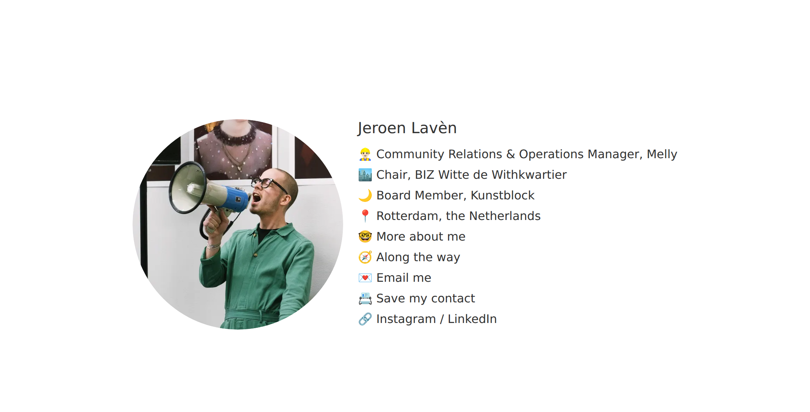
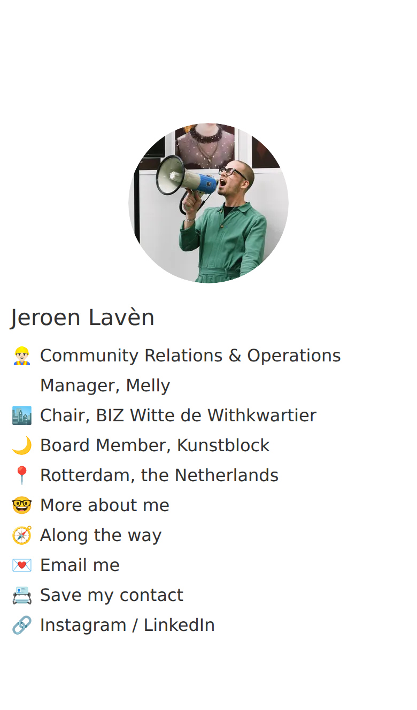
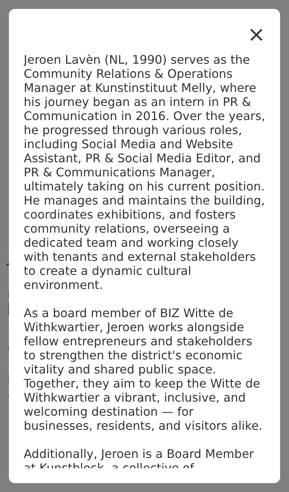
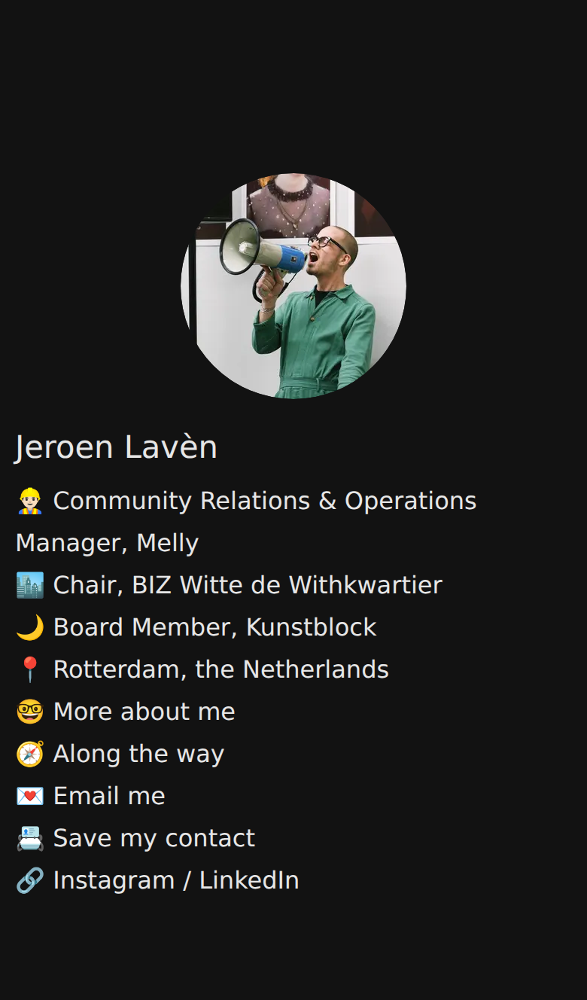
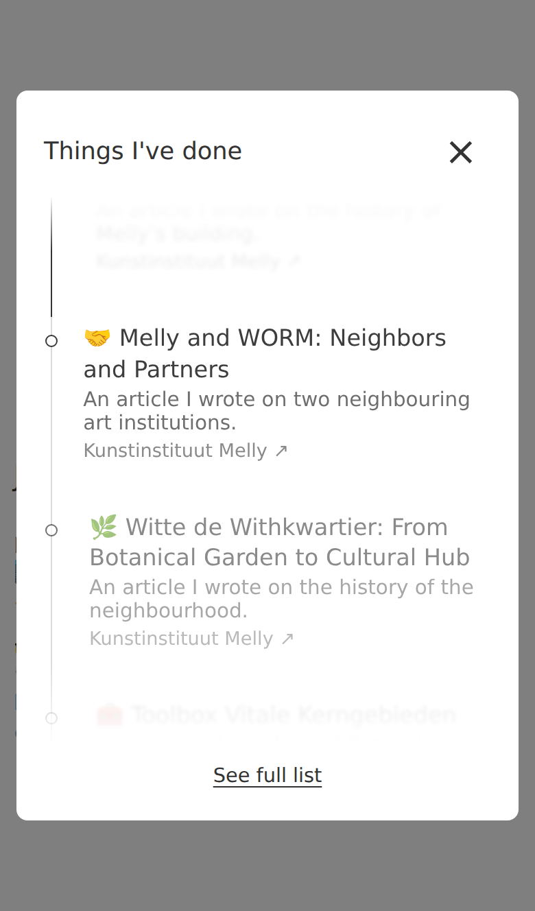

# visuology.nl

The personal website of **Jeroen Lavèn**: a one-page link-in-bio site with a short introduction, an "about me" pop-up and links to email, Instagram and LinkedIn.

**Live:** [visuology.nl](https://visuology.nl)



<p>
  
  
  
  
</p>

## Features

- **Tiny and fast:** plain HTML, CSS and a few lines of JavaScript. No frameworks, build step or web fonts. A first visit loads about 25 KB.
- **Works on any screen:** the layout stacks on phones, and the "about me" pop-up always fits the screen with its text scrolling inside.
- **Dark mode** follows the visitor's device setting.
- **Along the way:** a minimal timeline. As you scroll, the entry at the focus point comes into sharp view, the others fade and blur away, and the line fills up as dots light up. Each entry links to a website or article, and "See full list" shows everything at once.
- **Click the photo** to see the wave animation (skipped for visitors who prefer reduced motion) and hear a hello sound (first tap of a visit only, at 60% volume), while a speech bubble pops out of the megaphone with a short line. Edit the lines in `megaphoneLines` at the top of the script; a line written as `{ text: '…', url: '…' }` turns the bubble into a link (used for Kunstavond, the coffee invitation and email).
- **Next Kunstavond:** one of the megaphone's lines (and always the first) gives the date of the next Kunstavond (first Friday of the month, 18:00–21:00), worked out automatically, or says "tonight" / "on now" on the day. Add months without a Kunstavond to `kunstavondSkip`, e.g. `'2027-08'`.
- **Save my contact:** phones download a contact card (`jeroen-laven.vcf`, with photo); computers show a QR code (`qr-contact.svg`) to scan with a phone. After changing your details, update both files.
- **"Psst… tap me! 📣"**: first-time visitors get a soft wave and this hint a few seconds after arriving, until they've tapped the photo once (remembered in their browser). On computers the photo also grows slightly and shows "Click me" on hover.
- **Greets visitors** depending on where they came from: "Hi from LinkedIn! 👋", "Found me! 🔎" from search engines, and "Nice to meet you in person! 🤝" for people who tap the website in your saved contact card (it links to `?via=card`).
- **Time-aware megaphone:** one of the lines fits the time of day in Rotterdam (morning coffee, lunchtime, Friday afternoon, weekend, evening, late night). Edit them in `timeLine()`.
- **Print as CV:** printing the page or saving it as PDF gives a clean CV with your roles, the about text and the full "Along the way" list, without buttons or pop-ups.
- **Accessible:** the photo and close buttons are real buttons, the pop-up is announced as a dialog, focus moves into it and back, and <kbd>Esc</kbd> closes it.
- **Good link previews and search results:** a meta description, Open Graph tags for LinkedIn, WhatsApp and Slack, and `Person` structured data for Google.

## Files

| File | What it is |
| --- | --- |
| `index.html` | The page, including its small script |
| `style.css` | All styling, with light and dark colours as CSS variables at the top |
| `jeroen-300.*` / `jeroen-600.*` | The profile photo in two sizes (WebP, with a JPEG fallback for old browsers); sharp screens and the larger desktop layout get the 600px version |
| `og-image-800.jpg` | The image used in link previews |
| `sound.mp3` | The sound played when the photo is clicked |
| `favicon*`, `apple-touch-icon.png`, `android-chrome-*`, `mstile-150x150.png`, `site.webmanifest`, `browserconfig.xml` | Browser and home-screen icons |
| `jeroen-laven.vcf` / `qr-contact.svg` | The contact card (with photo) and the QR code shown on computers |
| `404.html` | The "page not found" page |
| `robots.txt` / `sitemap.xml` | Point search engines to the page |
| `CNAME` | Points GitHub Pages at the `visuology.nl` domain |
| `docs/` | Screenshots for this README |

## Editing

Edit `index.html` or `style.css`, commit, and push to the **`gh-pages`** branch. GitHub Pages publishes it to visuology.nl within a minute or two.

> **After changing `style.css`**, raise the number in `style.css?v=2` in `index.html` (to `?v=3`, and so on). Otherwise visitors' browsers may keep using the old cached stylesheet with the new page.

To preview locally, open `index.html` in a browser, or run a small server:

```sh
python3 -m http.server 8000
# then visit http://localhost:8000
```

### Adding something to "Along the way"

The entries are a plain HTML list in `index.html` (search for `id="work-list"`), so search engines can read them. The timeline is built from this list. Copy an `<li>` and fill it in, newest first:

```html
<li data-year="2026">
    <a class="list-link" href="https://…" target="_blank" rel="noopener">
        <span class="list-year">2026</span>
        <span class="list-title"><span class="list-emoji">🏛️</span> Title of the article or project</span>
        <span class="list-desc">One short sentence.</span>
        <span class="list-source">Source name ↗</span>
    </a>
</li>
```

The description line is optional. Leave out `data-year` and the year text if there's no date.

### Visitor statistics

[GoatCounter](https://www.goatcounter.com) counts visits without cookies, at https://visuology.goatcounter.com. Besides page views it counts opened pop-ups, megaphone clicks, the coffee invitation, Kunstavond, email, saving the contact card and outgoing links (look for `track(` in `index.html`).

### Search engines

- The page title, description and `ProfilePage` structured data (in the `<head>`) describe who you are; update them when your role changes.
- `robots.txt` and `sitemap.xml` point search engines to the page. Update `lastmod` in `sitemap.xml` after bigger changes.

### Replacing the photo

Export a square photo at 300 × 300 px and 600 × 600 px, as both WebP and JPEG, with location and camera data removed. For example, with ImageMagick:

```sh
convert original.jpg -strip -resize 300x300 -quality 80 jeroen-300.webp
convert original.jpg -strip -resize 300x300 -quality 82 jeroen-300.jpg
convert original.jpg -strip -resize 600x600 -quality 78 jeroen-600.webp
convert original.jpg -strip -resize 600x600 -quality 80 jeroen-600.jpg
convert original.jpg -strip -resize 800x800 -quality 80 og-image-800.jpg
```

### After changing the text

If you change your job title or links, update the matching lines in the `<head>` of `index.html` too: the `description`, the `og:` tags and the JSON-LD `Person` block. That keeps link previews and search results in sync.
